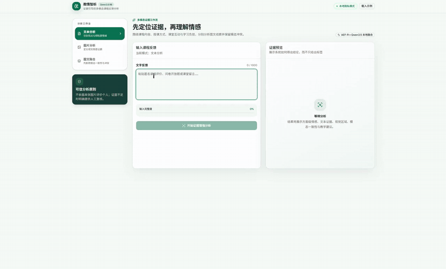

# 教情智析

基于 AEF-R（Aspect-guided Evidence Fusion and Reasoning）证据融合推理框架的多模态课程反馈分析系统。

## 演示视频

下方动态图展示完整操作流程（约 57 秒，包含文本、图片与图文融合分析）：

<p align="center">
  
</p>

[▶ 播放或下载有声高清版演示视频](docs/demo.mp4)

## 已实现

- 文本情感分析、图片氛围分析、图文联合分析
- 三种模式严格隔离：文本模式不读取图片，图片模式不读取文本，仅图文融合同时使用两种输入
- 课程方面级情感拆分与文本证据定位
- 规则证据与 Qwen 轻量语义分类双通道，覆盖短句、口语、否定、转折和反讽
- 图像显著区域证据描述
- 图片 OCR、宣传语语义、人物姿态、场景和传播情感联合判断
- 动态模态门控、图文一致性与冲突判断
- 结构化情绪、置信度、洞察与教学建议
- 无模型密钥可运行的 AEF-R Lite 本地模式
- 可选 Gemini / OpenAI 兼容多模态模型进行“证据约束”的语义视觉理解与解释增强

## 环境要求

- Python 3.11+
- Node.js 22.13+
- 可选：Ollama 与 `qwen3.5:9b`（启用本地大模型分析时需要）

## 首次安装

```bash
cd backend
python3 -m venv .venv
.venv/bin/pip install -r requirements.txt
cp .env.example .env

cd ../frontend
npm ci
cd ..
```

默认配置使用无需模型的 AEF-R Lite。若要启用本地 Qwen，请先执行 `ollama pull qwen3.5:9b`，再按照 `backend/.env.example` 中的说明修改 `backend/.env`。

## 启动

```bash
./start.sh
```

前端地址：`http://localhost:3000`  
后端接口文档：`http://localhost:8000/docs`

## 配置大模型（可选）

复制 `backend/.env.example` 为 `backend/.env`，填写模型接口并设置 `ENABLE_LLM=true`。示例默认使用 Gemini 的 OpenAI 兼容入口；也可填写原型中使用的兼容服务。密钥只保存在后端，前端不会接触或暴露密钥。

本项目支持调用 Ollama 中的 `qwen3.5:9b`（9.7B、支持视觉）。竞赛实例使用独立端口 `11435`，不会与默认 Ollama 服务的 `11434` 端口冲突；模型位于自定义目录时，可通过 `OLLAMA_MODELS_PATH` 配置。`./start.sh` 会在需要时自动启动 Ollama、FastAPI 和前端。模型会接收图片并补充语义级视觉证据，但最终极性、动态门控和冲突判断仍由 AEF-R 控制。

不配置本地模型或云端密钥时，系统仍可用 AEF-R Lite 完整演示文本、图片和图文融合流程。

切换分析模式或修改输入会立即清除旧结果并取消旧请求，避免上一轮结果覆盖当前模式。

## 目录

- `frontend/`：React/Vinext 前端
- `backend/`：FastAPI 分析服务
- `docs/`：竞赛材料
